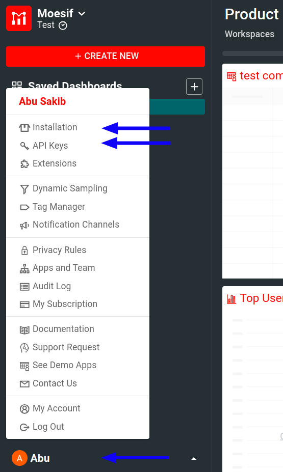

# Moesif Cloudflare SDK Documentation
by [Moesif](https://moesif.com), the [API analytics](https://www.moesif.com/features/api-analytics) and [API monetization](https://www.moesif.com/solutions/metered-api-billing) platform.

> If you're new to Moesif, see [our Getting Started](https://www.moesif.com/docs/) resources to quickly get up and running.

## Overview
This SDK allows you to integrate [Moesif](https://www.moesif.com) with [Cloudflare Workers](https://developers.cloudflare.com/workers/) using the new ECMAScript modules (ES modules).

This NPM package only supports Node.js version 18 and 20.

## Important Note about Legacy Service Worker Model
If you are using Cloudflare's [Service Workers API](https://developers.cloudflare.com/workers/reference/migrate-to-module-workers/) instead of the new ES modules,
please follow the [legacy instructions](/legacy/README.md).

## Prerequisites
Before using this middleware, make sure you have the following:

- [An active Moesif account](https://moesif.com/wrap)
- [A Moesif Application ID](#get-your-moesif-application-id)

### Get Your Moesif Application ID
After you log into [Moesif Portal](https://www.moesif.com/wrap), you can get your Moesif Application ID during the onboarding steps. You can always access the Application ID any time by following these steps from Moesif Portal after logging in:

1. Select the account icon to bring up the settings menu.
2. Select **Installation** or **API Keys**.
3. Copy your Moesif Application ID from the **Collector Application ID** field.



## Install the SDK

In the directory of your Worker project created with Wranger, install the SDK:

```bash
npm install moesif-cloudflare
```

## Configure the SDK
See the available [configuration options](#configuration-options) to learn how to configure the middleware for your use case.

## How to Use
Using the SDK involves three simple steps:

1. Import the `moesifMiddleware` function.
2. Specify your [Moesif Application ID](#get-your-moesif-application-id) in the Moesif `options` object.
3. Wrap your handler with `moesifMiddleware`.

For example:

```javascript:highlight={1,3-5,13}
import moesifMiddleware from 'moesif-cloudflare';

const options = {
  applicationId: 'YOUR MOESIF Application ID',
};

// your original fetch handler.
async function originalFetchHandler(request, _env, context) {
  // your code.
}

// this create a new fetch that is wrapped by moesifMiddleware
const wrappedFetchHandler = moesifMiddleware(originalFetch, options);

// export the fetch handler.
export default {
  fetch: wrappedFetchHandler
};
```

## Troubleshoot
For a general troubleshooting guide that can help you solve common problems, see [Server Troubleshooting Guide](https://www.moesif.com/docs/troubleshooting/server-troubleshooting-guide/).

Other troubleshooting supports:

- [FAQ](https://www.moesif.com/docs/faq/)
- [Moesif support email](mailto:support@moesif.com)

## Repository Structure

```
.
├── esm/
├── example-project/
├── images/
├── legacy/
├── LICENSE
└── README.md
```

## Configuration Options
The following sections describe the available configuration options for this SDK. You can set these options in the Moesif initialization options object. See [the example Worker project code](https://github.com/Moesif/moesif-cloudflare/blob/717d1202da5996f12c74046e7c7ec75654bd819e/example-project/src/index.js#L40) for an example.

You can see the full list of options in the [prepareOptions.mjs](/esm/src/prepareOptions.mjs) file.

### `identifyUser`

<table>
  <tr>
   <th scope="col">
    Data type
   </th>
   <th scope="col">
    Parameters
   </th>
   <th scope="col">
    Return type
   </th>
  </tr>
  <tr>
   <td>
    Function
   </td>
   <td>
    <code>(req, res, env, ctx)</code>
   </td>
   <td>
    <code>String</code>
   </td>
  </tr>
</table>

#### Parameters:

- **`req`**: a [`Request`](https://developers.cloudflare.com/workers/runtime-apis/request/) object.
- **`res`**: a [`Response`](https://developers.cloudflare.com/workers/runtime-apis/response/) object.
- **`env`**: an `env` object representing the [bindings](https://developers.cloudflare.com/workers/configuration/environment-variables/) available to the Worker.
- **`ctx`**: [a `Context` API object](https://developers.cloudflare.com/workers/runtime-apis/context/).

The function returns a user ID string. This allows Moesif to attribute API requests to individual unique users
so you can understand who is calling your API. You can use this simultaneously with [`identifyCompany`](#identifycompany)
to track both individual customers and the companies they are a part of.

See the [example project's `identifyUser` function](https://github.com/Moesif/moesif-cloudflare/blob/717d1202da5996f12c74046e7c7ec75654bd819e/example-project/src/index.js#L42) for an example.

### `identifyCompany`
<table>
  <tr>
   <th scope="col">
    Data type
   </th>
   <th scope="col">
    Parameters
   </th>
   <th scope="col">
    Return type
   </th>
  </tr>
  <tr>
   <td>
    Function
   </td>
   <td>
    <code>(req, res, env, ctx)</code>
   </td>
   <td>
    <code>String</code>
   </td>
  </tr>
</table>

#### Parameters:

- **`req`**: a [`Request`](https://developers.cloudflare.com/workers/runtime-apis/request/) object.
- **`res`**: a [`Response`](https://developers.cloudflare.com/workers/runtime-apis/response/) object.
- **`env`**: an `env` object representing the [bindings](https://developers.cloudflare.com/workers/configuration/environment-variables/) available to the Worker.
- **`ctx`**: [a `Context` API object](https://developers.cloudflare.com/workers/runtime-apis/context/).

This function returns a company ID string. If you have a B2B business, this allows Moesif to attribute
API requests to specific companies or organizations so you can understand which accounts are
calling your API. You can use this simultaneously with [`identifyUser`](#identifyuser) to track both
individual customers and the companies they are a part of.

See the [example project's `identifyCompany` function](https://github.com/Moesif/moesif-cloudflare/blob/717d1202da5996f12c74046e7c7ec75654bd819e/example-project/src/index.js#L47) for an example.

### `getSessionToken`
<table>
  <tr>
   <th scope="col">
    Data type
   </th>
   <th scope="col">
    Parameters
   </th>
   <th scope="col">
    Return type
   </th>
  </tr>
  <tr>
   <td>
    Function
   </td>
   <td>
    <code>(req, res, env, ctx)</code>
   </td>
   <td>
    <code>String</code>
   </td>
  </tr>
</table>

#### Parameters
- **`req`**: a [`Request`](https://developers.cloudflare.com/workers/runtime-apis/request/) object.
- **`res`**: a [`Response`](https://developers.cloudflare.com/workers/runtime-apis/response/) object.
- **`env`**: an `env` object representing the [bindings](https://developers.cloudflare.com/workers/configuration/environment-variables/) available to the Worker.
- **`ctx`**: [a `Context` API object](https://developers.cloudflare.com/workers/runtime-apis/context/).

This function returns a session token such as an API key.

For example:

```javascript
var options = {
  getSessionToken: function (req, res, env, ctx) {
    // your code here must return a string. Example Below
    return req.headers.get['Authorization'];
  }
}
```

### `getApiVersion`
<table>
  <tr>
   <th scope="col">
    Data type
   </th>
   <th scope="col">
    Parameters
   </th>
   <th scope="col">
    Return type
   </th>
  </tr>
  <tr>
   <td>
    Function
   </td>
   <td>
    <code>(req, res, env, ctx)</code>
   </td>
   <td>
    <code>String</code>
   </td>
  </tr>
</table>

#### Parameters
- **`req`**: a [`Request`](https://developers.cloudflare.com/workers/runtime-apis/request/) object.
- **`res`**: a [`Response`](https://developers.cloudflare.com/workers/runtime-apis/response/) object.
- **`env`**: an `env` object representing the [bindings](https://developers.cloudflare.com/workers/configuration/environment-variables/) available to the Worker.
- **`ctx`**: [a `Context` API object](https://developers.cloudflare.com/workers/runtime-apis/context/).

This function
returns a string to tag requests with a specific version of your API.

For example:

```javascript
var options = {
  getApiVersion: function (req, res, env, ctx) {
    // your code here must return a string. Example Below
    return req.headers.get['X-Api-Version']
  }
}
```

### `maskContent`
<table>
  <tr>
   <th scope="col">
    Data type
   </th>
   <th scope="col">
    Parameters
   </th>
   <th scope="col">
    Return type
   </th>
  </tr>
  <tr>
   <td>
    Function
   </td>
   <td>
    <code>(MoesifEventModel)</code>
   </td>
   <td>
    <code>MoesifEventModel</code>
   </td>
  </tr>
</table>

A function that takes the final Moesif event model as an
argument before the middleware sends the event model object to Moesif. 

With `maskContent`, you can make modifications to headers or body such as
removing certain header or body fields.

```javascript
import _ from 'lodash';

var options = {
  maskContent: function(event) {
    // remove any field that you don't want to be sent to Moesif.
    const newEvent = _.omit(event, ['request.headers.Authorization', 'event.response.body.sensitive_field'])
    return newEvent;
  }
};
```

Moesif's event model format looks like this:

```json
{
  "request": {
    "time": "2022-08-08T04:45:42.914",
    "uri": "https://api.acmeinc.com/items/83738/reviews/",
    "verb": "POST",
    "api_version": "1.1.0",
    "ip_address": "61.48.220.123",
    "headers": {
      "Host": "api.acmeinc.com",
      "Accept": "*/*",
      "Connection": "Keep-Alive",
      "Content-Type": "application/json",
      "Content-Length": "126",
      "Accept-Encoding": "gzip"
    },
    "body": {
      "items": [
        {
          "direction_type": 1,
          "item_id": "fwdsfrf",
          "liked": false
        },
        {
          "direction_type": 2,
          "item_id": "d43d3f",
          "liked": true
        }
      ]
    }
  },
  "response": {
    "time": "2022-08-08T04:45:42.924",
    "status": 500,
    "headers": {
      "Vary": "Accept-Encoding",
      "Pragma": "no-cache",
      "Expires": "-1",
      "Content-Type": "application/json; charset=utf-8",
      "Cache-Control": "no-cache"
    },
    "body": {
      "Error": "InvalidArgumentException",
      "Message": "Missing field location"
    }
  },
  "user_id": "my_user_id",
  "company_id": "my_company_id",
  "session_token":"end_user_session_token",
  "tags": "tag1, tag2"
}
```

For more information about the different fields of Moesif's event model,
see the following table or the [Moesif Node.js API documentation](https://www.moesif.com/docs/api?javascript).

Name | Required | Description
--------- | -------- | -----------
`request` | Yes | The object that specifies the API request.
`request.time`| Yes | Timestamp for the request in ISO 8601 format.
`request.uri`| Yes | Full URI such as `https://api.com/?query=string` including host, query string, and so on.
`request.verb`| Yes | The HTTP method—for example, `GET` and `POST`.
`request.api_version`| No | API Version you want to tag this request with such as `1.0.0`.
`request.ip_address`| No | IP address of the client. If not set, Moesif uses the IP address of your logging API calls.
`request.headers`| Yes | Headers of the  request as a `Map<string, string>` object. Multiple headers with the same key name should be combined together such that the values are joined by a comma. For more information, see [HTTP Header Protocol on w3.org](https://www.w3.org/Protocols/rfc2616/rfc2616-sec4.html#sec4.2)
`request.body`| No | Body of the request in JSON format or base64 encoded binary data. To specify the transfer encoding, use `request.transfer_encoding`.
`request.transfer_encoding`| No | A string that specifies the transfer encoding of the request body sent to Moesif. If not specified, Moesif assumes the request body assumed to be JSON or text. Only supported value is `base64` for sending binary data like protocol buffers.
||
`response` | No | The object that specifies the `response message`. If not set, it implies a null response such as a timeout.
`response.time`| Yes | Timestamp for the response in ISO 8601 format.
`response.status`| Yes | HTTP response status code number such as `200 OK` or `500 Internal Server Error`.
`response.ip_address`| No | IP address of the responding server.
`response.headers`| Yes | Headers of the response as a `Map<string, string>` object. Multiple headers with the same key name should be combined together such that the values are joined by a comma. For more information, see [HTTP Header Protocol on w3.org](https://www.w3.org/Protocols/rfc2616/rfc2616-sec4.html#sec4.2)
`response.body`| No | Body of the response in JSON format or base64 encoded binary data. To specify the transfer encoding, use `response.transfer_encoding`
`response.transfer_encoding`| No | A string that specifies the transfer encoding of the request body sent to Moesif. If not specified, Moesif assumes the body to be JSON or text. Only supported value is `base64` for sending binary data like protocol buffers.
||
`session_token` | Recommended | The end user session token such as a JWT or API key, which may or may not be temporary. Moesif automatically detects the session token if not set.
`user_id` | Recommended | Identifies this API call to a permanent user ID.
`metadata` | No | A JSON Object consisting of any custom metadata to be stored with this event.

### `getMetadata`
<table>
  <tr>
   <th scope="col">
    Data type
   </th>
   <th scope="col">
    Parameters
   </th>
   <th scope="col">
    Return type
   </th>
  </tr>
  <tr>
   <td>
    Function
   </td>
   <td>
    <code>(req, res, env, ctx)</code>
   </td>
   <td>
    <code>Object</code>
   </td>
  </tr>
</table>

#### Parameters
- **`req`**: a [`Request`](https://developers.cloudflare.com/workers/runtime-apis/request/) object.
- **`res`**: a [`Response`](https://developers.cloudflare.com/workers/runtime-apis/response/) object.
- **`env`**: an `env` object representing the [bindings](https://developers.cloudflare.com/workers/configuration/environment-variables/) available to the Worker.
- **`ctx`**: [a `Context` API object](https://developers.cloudflare.com/workers/runtime-apis/context/).

This function returns an object containing custom metadata that Moesif can associate with the request. The metadata must be a simple JavaScript object that can be converted to JSON. 

For example, you may want to save a virtual machine instance ID, a trace ID, or a tenant ID with the request.

```javascript
var options = {
  getMetadata: function (req, res, env, ctx) {
    // your code here:
    return {
      foo: 'custom data',
      bar: 'another custom data'
    };
  }
}
```

### `skip`
<table>
  <tr>
   <th scope="col">
    Data type
   </th>
   <th scope="col">
    Parameters
   </th>
   <th scope="col">
    Return type
   </th>
  </tr>
  <tr>
   <td>
    Function
   </td>
   <td>
    <code>(req, res, env, ctx)</code>
   </td>
   <td>
    <code>Boolean</code>
   </td>
  </tr>
</table>

#### Parameters
- **`req`**: a [`Request`](https://developers.cloudflare.com/workers/runtime-apis/request/) object.
- **`res`**: a [`Response`](https://developers.cloudflare.com/workers/runtime-apis/response/) object.
- **`env`**: an `env` object representing the [bindings](https://developers.cloudflare.com/workers/configuration/environment-variables/) available to the Worker.
- **`ctx`**: [a `Context` API object](https://developers.cloudflare.com/workers/runtime-apis/context/).

This function returns `true`
if you want to skip the event. Skipping an event means Moesif doesn't log the event.

The following example skips requests to the root path `/` and the `/health` path:

```javascript
var options = {
  skip: function (req, res, env, ctx) {
    const url = new URL(req.url)
    // your code here must return a boolean. Example Below
    if (url.pathname === '/' || url.pathname === '/health') {
      // Skip logging traffic to root path or health probe.
      return true;
    }
    return false
  }
}
```

### `logBody`
<table>
  <tr>
   <th scope="col">
    Data type
   </th>
   <th scope="col">
    Default
   </th>
  </tr>
  <tr>
   <td>
    <code>Boolean</code>
   </td>
   <td>
    <code>true</code>
   </td>
  </tr>
</table>
Whether to log request and response body to Moesif.

### `hideCreditCards`
<table>
  <tr>
   <th scope="col">
    Data type
   </th>
   <th scope="col">
    Default
   </th>
  </tr>
  <tr>
   <td>
    <code>Boolean</code>
   </td>
   <td>
    <code>true</code>
   </td>
  </tr>
</table>

This masks any credit cards using the [Luhn algorithm](https://en.wikipedia.org/wiki/Luhn_algorithm).

### `disableTransactionId`
<table>
  <tr>
   <th scope="col">
    Data type
   </th>
   <th scope="col">
    Default
   </th>
  </tr>
  <tr>
   <td>
    <code>Boolean</code>
   </td>
   <td>
    <code>false</code>
   </td>
  </tr>
</table>

`X-Moesif-Transaction-Id` helps identify transactions in Moesif. Set this option to `true` to prevent insertion of `X-Moesif-Transaction-Id` response header.

### `debug`
<table>
  <tr>
   <th scope="col">
    Data type
   </th>
   <th scope="col">
    Default
   </th>
  </tr>
  <tr>
   <td>
    <code>Boolean</code>
   </td>
   <td>
    <code>false</code>
   </td>
  </tr>
</table>

Set to `true` to print debug logs. This may help you [troubleshoot](#troubleshoot) if you're having integration issues.

### `fetchTimeoutMS`
<table>
  <tr>
   <th scope="col">
    Data type
   </th>
   <th scope="col">
    Default
   </th>
  </tr>
  <tr>
   <td>
    <code>Number</code>
   </td>
   <td>
    <code>120000</code> milliseconds
   </td>
  </tr>
</table>

The fetch timeout in milliseconds so that Moesif can log the call even if origin server doesnt respond.

### `requestMaxBodySize`
<table>
  <tr>
   <th scope="col">
    Data type
   </th>
   <th scope="col">
    Default
   </th>
  </tr>
  <tr>
   <td>
    <code>Number</code>
   </td>
   <td>
    <code>100000</code>
   </td>
  </tr>
</table>

The maximum request body size in bytes to log when sending the data to Moesif.

### `responseMaxBodySize`
<table>
  <tr>
   <th scope="col">
    Data type
   </th>
   <th scope="col">
    Default
   </th>
  </tr>
  <tr>
   <td>
    <code>Number</code>
   </td>
   <td>
    <code>100000</code>
   </td>
  </tr>
</table>

The maximum response body size in bytes to log when sending the data to Moesif.

## Example

See the [`example-project` folder](/example-project/) for an example. The example 
generated is generated using C3 (`create-cloudflare-cli`) and follows the [Cloudflare get started guide](https://developers.cloudflare.com/workers/get-started/guide/).

## How to Get Help
If you face any issues using this middleware, try the [troubheshooting guidelines](#troubleshoot). For further assistance, reach out to our [support team](mailto:support@moesif.com).

## Explore Other Integrations

Explore other integration options from Moesif:

- [Server integration options documentation](https://www.moesif.com/docs/server-integration//)
- [Client integration options documentation](https://www.moesif.com/docs/client-integration/)

